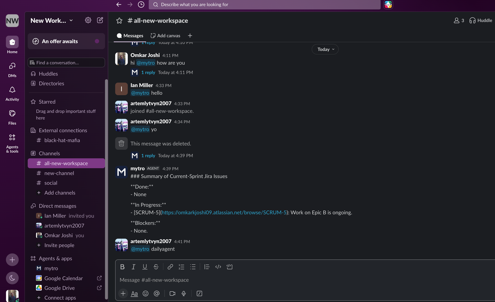

# Proof of concept: end-to-end `@dailyagent` standup digest in Slack



## What this shows

A real Slack mention (`@mytro dailyagent`) triggering the full pipeline, live, in an
actual Slack workspace:

```
Slack mention
   -> CopilotKit Channels (Node)
   -> AG-UI
   -> Python LangGraph agent
   -> Jira Cloud REST API (real "black-hat-mafia" site, SCRUM project)
   -> summarized digest
   -> reply posted back to the Slack thread
```

The agent (`mytro`) replied with:

```
### Summary of Current-Sprint Jira Issues

**Done:**
- None

**In Progress:**
- [SCRUM-5](https://omkarkjoshi09.atlassian.net/browse/SCRUM-5): Work on Epic B is ongoing.

**Blockers:**
- None.
```

That link is a real, live Jira issue in the project used for C3's manual verification
(`scripts/manual_verify_jira.py`) — this isn't mocked or hand-typed, it's the agent
actually calling out to Jira and reporting back in Slack.

## Why this matters: the A1 blocker, actually fixed

`TASKS.md` task A1 previously reported the CopilotKit-hosted Slack delivery pipeline as
**blocked** — agent replies were generated (confirmed in the CopilotKit dashboard's State
tab) but never appeared in Slack, logged as a `CHANNEL_HEALTH_ERROR` / "Delivery failing"
status, with a case filed against CopilotKit support as a suspected hosted-pipeline bug.

The real root cause turned out to be ours, not CopilotKit's: their Slack renderer only reads
`TEXT_MESSAGE_START/CONTENT/END` (plus tool-call/custom events) — it never reads
`MESSAGES_SNAPSHOT`. Our graph was only emitting the reply via a state update, so the AG-UI
stream carried a `MESSAGES_SNAPSHOT` but zero `TEXT_MESSAGE_*` events, and CopilotKit
correctly delivered an empty message. Fixed in `agent/graph.py` via `emit_assistant_text`
(see the full writeup under task A1 in `TASKS.md`). This screenshot is the live confirmation
of that fix: a real `@mytro dailyagent` mention producing a real Jira-derived digest that
actually lands in the Slack thread.

## Caveat

This screenshot also incidentally shows real workspace member names and channel names from
the team's own testing Slack workspace — not sensitive (no tokens/credentials), just noted
for context on what's visible in the image.
